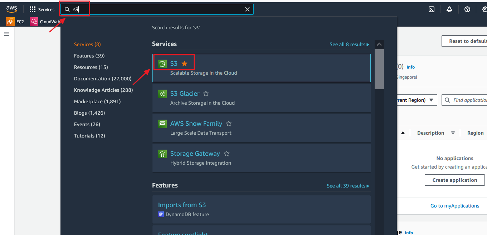
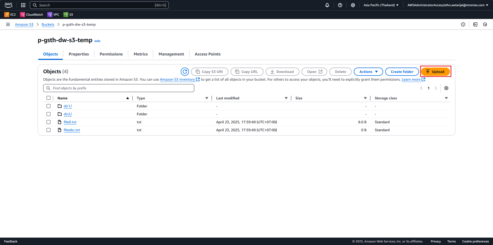
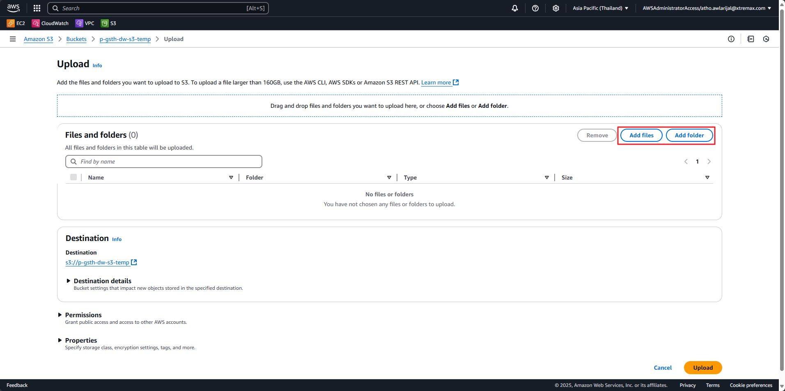
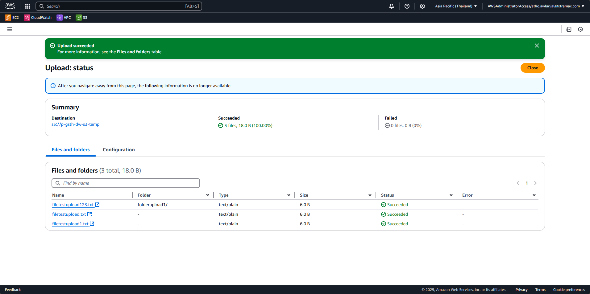
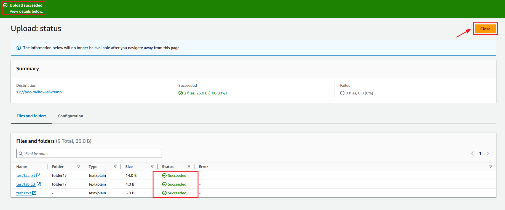

# Amazon Simple Storage Service (S3)

## 4.1. Upload/download via AWS CLI

#### 1. Open terminal, ensure AWS CLI configured, and user has access to S3.

#### 2. Run this command to upload/copy from local machine to S3.

```bash
aws s3 cp <source file> <s3 uri> --profile <profilename>
```

**Example, copy file0.txt to s3 bucket named p-gsth-dw-s3-temp:**

```bash
aws s3 cp tutorial/file0.txt s3://p-gsth-dw-s3-temp --profile <profilename>
```


> **Note:** if you command return something like this, it means that the user does not have permission to upload file to s3

Check using `aws s3 ls <s3 uri> --profile <profilename>` command


If want upload/copy folder that contains files/folder, add `--recursive`:

```bash
aws s3 cp <source folder> <s3 uri> --recursive --profile <profilename>
```

**Example copy entire file/folder to s3 bucket named p-gsth-dw-s3-temp:**

```bash
aws s3 cp tutorial/ s3://p-gsth-dw-s3-temp --recursive --profile <profilename>
```


### 3. Run this command to download file from S3 to local machine.

```bash
aws s3 cp <s3 uri> <local file> --profile <profilename>
```

**Example download from s3 to current path (can using .):**

```bash
aws s3 cp s3://p-gsth-dw-s3-temp/file0a.txt . --profile <profilename>
```


If want upload/copy folder that contains files/folder, add `--recursive`:

```bash
aws s3 cp <s3 uri> <destination> --recursive --profile <profilename>
```

**Example copy folder/files:**

```bash
aws s3 cp s3://p-gsth-dw-s3-temp/dir1/ test123/ --recursive --profile <profilename>
```


## 4.2. Upload/download via AWS Management Console

#### 1. Open AWS Management Console, go to S3 page by type s3 in search bar.


#### 2. Select the S3 Bucket by clicking it. For example, p-gsth-dw-s3-temp bucket

#### 3. To upload file/folder click the Upload button. If want to upload to specific folder can navigate to folder first or can create new folder if needed.



#### 4. Choose want upload file(s) or folder(s) by clicking the Add files or Add folder button.



#### 5. After choosing the files or/and folder, the list will appear then click the Upload button.



#### 6. There will be upload message status, then click the Close button.



#### 7. To download file via s3 console only select 1 file, to download multiple files must be via AWS CLI. To download file, select the file then click the Download button.

 